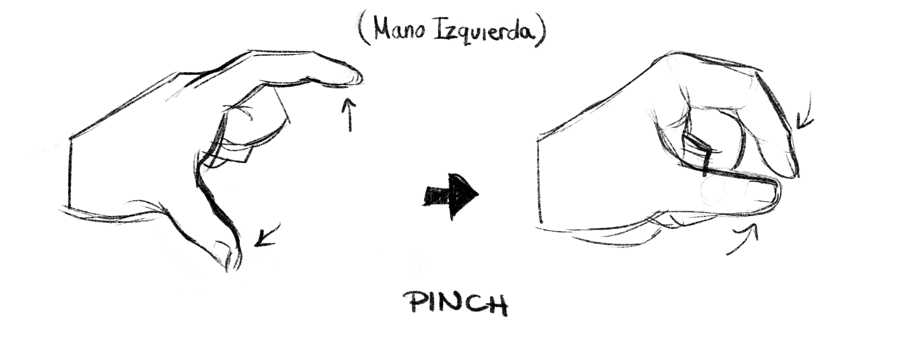
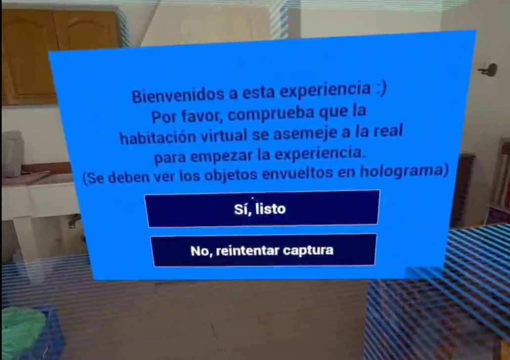
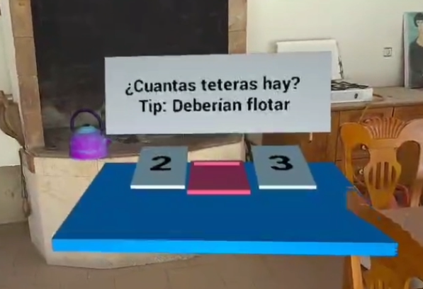
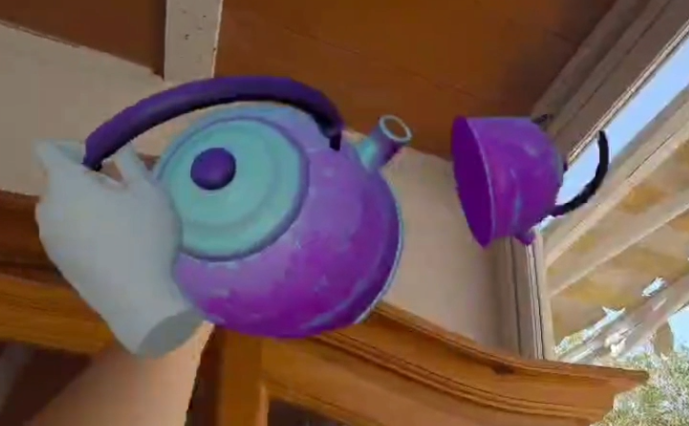
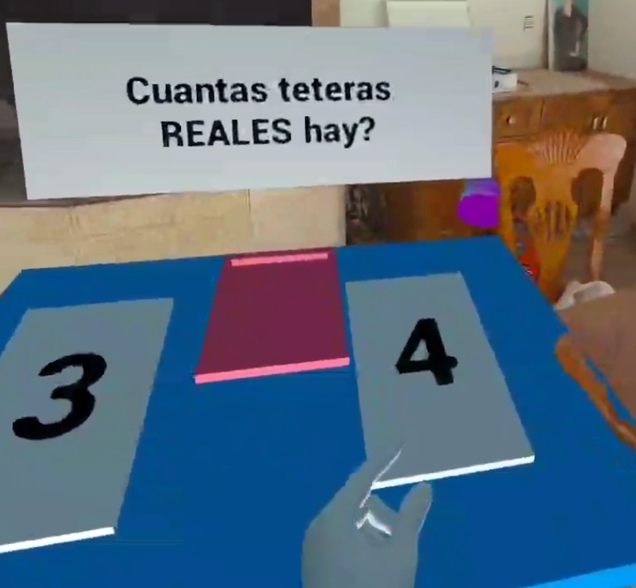

# IsItReal

En esta experiencia de realidad mixta en **gravedad 0** tienes un único propósito: contar cuantas teteras hay en la habitación. Para ello, deberás seleccionar una de las cartas con el número que te proponen, ¿podrás cumplir con el objetivo?

### Cómo jugar

> **AVISO:** Al hacer uso de *herramientas experimentales*, puede que la aplicación dé algunos problemas. Desaconsejo actualizar/crear una nueva habitación desde la propia experiencia, ya que no puede cargar la nueva habitación desde la aplicación.

> Si aparece el mensaje "**Could not load MR Scene Model.**", será porque no se ha encontrado el modelo de la sala. Para evitarlo y hacer que funcione, deberás escanear y guardar la habitación desde la configuración y volver a iniciar la experiencia.

> Otro detalle: Debido a las oclusiones, puede que los objetos se escondan detrás de los reales, puesto que no he considerado este caso, lo implementaré más adelante.

Los controles son sencillos: se puede interactuar con los objetos y el menú inicial, deberás hacerlo únicamente tu mano izquierda (para más dificultad), lo que te permite coger los objetos virtuales con el dedo índice y el pulgar (pinch).

Al iniciar la experiencia, se te presentará un menú de inicio para que compruebes si la habitación virtual es parecida a la real, en el caso de que hayan objetos o muebles raros, puedes actualizarlo desde "No, reintentar captura".

Deberás contar el número de teteras reales, por lo que te recomiendo cogerlas para probar su veracidad.

 

Cuando sepas la respuesta a la pregunta que se te propone, deberás escoger la carta con la respuesta y dejarla sobre la mesa. ¡TEN CUIDADO! Algunos objetos no se consideran REALES, deberás averiguar si lo son.

### Licencias
Todos los modelos 3D han sido desarrollados por mí. Si se quieren hacer uso de ellos, contactad conmigo.

Otros assets como el SkyLight se ha escogido de Unreal.

#### Sonido
Estos assets se hayan en la dirección "Project/Content/IsItReal/Assets/Music/". Se han convertido a .uasset para su uso y facilitar la subida al repositorio.

##### background_sound.uasset
* <a href="https://freesound.org/people/Dwy/sounds/581829/">Tape No. R-S 5 (Lo-fi loop)</a> by <a href="https://freesound.org/people/Dwy/">Dwy</a> | License: <a href="http://creativecommons.org/publicdomain/zero/1.0/">Creative Commons 0</a> 
* <a href="https://freesound.org/people/felineterror/sounds/581642/">R-S 5</a> by <a href="https://freesound.org/people/felineterror/">felineterror</a> | License: <a href="http://creativecommons.org/publicdomain/zero/1.0/">Creative Commons 0</a>

##### 571502__kagateni__cute1.uasset
* <a href="https://freesound.org/people/Kagateni/sounds/571502/">Cute1.mp3</a> by <a href="https://freesound.org/people/Kagateni/">Kagateni</a> | License: <a href="https://creativecommons.org/licenses/by/4.0/">Attribution 4.0</a>

##### 658270__lilmati__retro-spare-or-eat-cute-creature.uasset

* <a href="https://freesound.org/people/LilMati/sounds/658270/">Retro, Spare Or Eat Cute Creature.wav</a> by <a href="https://freesound.org/people/LilMati/">LilMati</a> | License: <a href="http://creativecommons.org/publicdomain/zero/1.0/">Creative Commons 0</a>

##### 546081__stavsounds__correct3.uasset

* <a href="https://freesound.org/people/StavSounds/sounds/546081/">correct3.wav</a> by <a href="https://freesound.org/people/StavSounds/">StavSounds</a> | License: <a href="http://creativecommons.org/publicdomain/zero/1.0/">Creative Commons 0</a>

##### 351563__bertrof__game-sound-incorrect-with-delay.uasset

* <a href="https://freesound.org/people/Bertrof/sounds/351563/">Game Sound Incorrect With Delay</a> by <a href="https://freesound.org/people/Bertrof/">Bertrof</a> | License: <a href="http://creativecommons.org/licenses/by/3.0/">Attribution 3.0</a>

##### 588234__mehraniiii__win.uasset

* <a href="https://freesound.org/people/mehraniiii/sounds/588234/">win.wav</a> by <a href="https://freesound.org/people/mehraniiii/">mehraniiii</a> | License: <a href="http://creativecommons.org/publicdomain/zero/1.0/">Creative Commons 0</a>

##### 362206__taranp__horn_fail_wahwah_1.uasset

* <a href="https://freesound.org/people/TaranP/sounds/362206/">horn_fail_wahwah_1.wav</a> by <a href="https://freesound.org/people/TaranP/">TaranP</a> | License: <a href="http://creativecommons.org/publicdomain/zero/1.0/">Creative Commons 0</a>

## Entrevista

### Proceso de creación

P: **¿Qué dificultades has encontrado durante el desarrollo? ¿Cómo las has resuelto?**

La principal dificultad del desarrollo de esta experiencia ha sido el trabajar con herramientas experimentales. La realidad mixta de Meta va evolucionando y actualizandose constantemente en el momento de la creación de este proyecto, impidiendo que sea un proceso suave.
Para resolver estos problemas, he optado por quedarme con una versión específica del plugin MRUK e intentar adaptarlo a las necesidades de la aplicación y gafas.

Un problema que no he logrado aplacar ha sido el de la carga de escena, **debe** haber una **habitación escaneada previamente** a empezar la experiencia.

### Siguientes pasos

De cara a futuro, me gustaría añadir más elementos virtuales a la experiencia, además de añadir más variedad de "teteras", como por ejemplo:

* Conseguir cargar el "Global Mesh" de la escena
* Teteras reales pueden dejar caer té
* Tetera fantasma que aparece de reojo
* Diferentes texturas para las teteras
* Añadir más dificultad
* Pulir número de elementos que aparecen en escena
* Considerar zonas donde aparecen
* Añadir un diseño diferente a la mesa de selección
